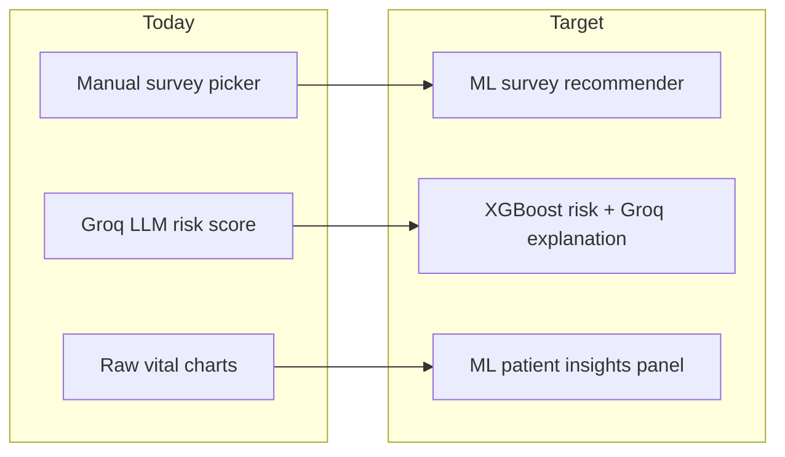
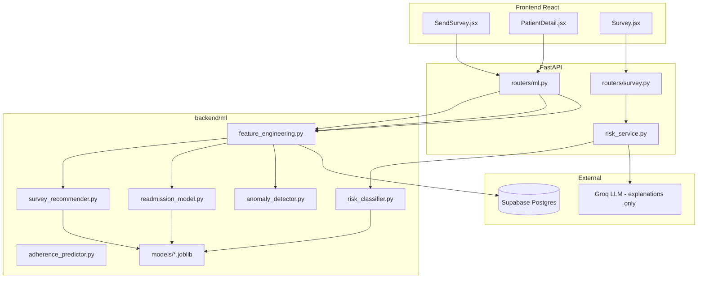

# ML Integration Plan for Discharge+ 

## Current State (The Gap)

Today, all "AI" is **prompt engineering + Groq LLM API** in `[backend/services/ai_service.py](backend/services/ai_service.py)`. There are **no trained models**, no feature engineering pipeline, and no evaluation metrics. Risk scoring in `[backend/services/risk_service.py](backend/services/risk_service.py)` calls the LLM on every survey submit.

The doctor survey builder in `[frontend/src/pages/Doctor/SendSurvey.jsx](frontend/src/pages/Doctor/SendSurvey.jsx)` is fully manual—doctor picks question types with no disease or history context. Patient detail in `[frontend/src/pages/Doctor/PatientDetail.jsx](frontend/src/pages/Doctor/PatientDetail.jsx)` shows raw trend charts but no ML-derived insights.

**Goal:** Replace ~25% of product intelligence with **real ML** (scikit-learn / XGBoost), keeping Groq only for human-readable explanations.




---

## Proposed ML Modules (5 areas = ~25% of product)


| #   | Module                                | Where in app                        | ML technique                                     | Replaces / augments            |
| --- | ------------------------------------- | ----------------------------------- | ------------------------------------------------ | ------------------------------ |
| 1   | **Disease-Aware Survey Recommender**  | Doctor → Send Survey                | Multi-label classifier (XGBoost) + disease rules | Manual question-type selection |
| 2   | **Readmission Risk Predictor**        | Doctor → Patient Detail             | Binary classifier (XGBoost)                      | Static risk badge only         |
| 3   | **Vital Trajectory Anomaly Detector** | Doctor → Patient Detail             | Isolation Forest on time-series features         | Doctor eyeballing charts       |
| 4   | **Hybrid Risk Scoring**               | Patient → Survey submit             | XGBoost classifier + Groq explanation            | Pure LLM risk scoring          |
| 5   | **Medication Adherence Predictor**    | Patient → Dashboard / Doctor alerts | Logistic regression                              | Reactive missed-dose logging   |


Modules 1 and 2 directly address your examples. Modules 3–5 round out the ~25% ML footprint across doctor and patient flows.

---

## Module 1: Disease-Aware Survey Recommender (Priority)

**User story:** When a doctor selects a patient on Send Survey, ML suggests which of the 8 question types to include based on diagnosis, comorbidities, days post-discharge, and past survey outcomes.

### Input features (from existing schema)

- `patients.diagnosis` (text → encoded via TF-IDF or diagnosis category mapping)
- `patients.comorbidities[]`
- `patients.expected_recovery_days`, days since `discharge_date`
- Historical: which `question_types` correlated with `risk_level = high` for similar patients

### Model

- **Multi-label classifier** (one XGBoost or RandomForest per question type, or `MultiOutputClassifier`)
- Output: probability per question type + ranked recommendation list with confidence

### Cold-start strategy (little hospital data)

1. **Phase A:** Rule-based disease-to-vital mapping (e.g., diabetes → sugar + bp; cardiac → bp + spo2; post-surgical → pain + photo + fever)
2. **Phase B:** Train on public readmission/vitals datasets (MIMIC-III demo subset, UCI Diabetes) mapped to your 8 question types
3. **Phase C:** Retrain monthly on your `surveys` + `risk_scores` + `response_answers` as hospitals accumulate data

### API + UI

- New endpoint: `GET /ml/survey-recommendations?patient_id=...`
- Update `[frontend/src/pages/Doctor/SendSurvey.jsx](frontend/src/pages/Doctor/SendSurvey.jsx)`: on patient select, show "AI Suggested Questions" panel with checkboxes pre-selected and short ML reason per type (Groq generates the sentence from model output)

### New files

- `backend/ml/survey_recommender.py` — inference
- `backend/ml/training/train_survey_recommender.py` — training script
- `backend/ml/models/survey_recommender.joblib` — artifact
- `backend/routers/ml.py` — ML router

---

## Module 2: Patient History & Response Analysis (Priority)

**User story:** On Patient Detail, doctor sees an ML-generated "Clinical Insights" panel summarizing trajectory, not just charts.

### Features engineered from existing data

From `[backend/routers/doctor.py](backend/routers/doctor.py)` `get_patient_detail` data:

- Rolling stats on vitals: mean, slope, variance over last N surveys (`response_answers.answer_numeric`)
- Risk score trend: `risk_scores` time series
- Medication adherence rate from `medication_logs`
- Days post-discharge, diagnosis, comorbidities

### Models

1. **Readmission Risk Predictor** (XGBoost binary): P(readmit within 30 days) using vitals trajectory + demographics
2. **Trajectory Anomaly Detector** (Isolation Forest): flags if latest vitals deviate from patient's own baseline

### Output (ML insights panel)

- Readmission probability: 0–100% with top 3 SHAP feature contributors
- Trend alerts: "SpO2 declining 3 surveys in a row", "Pain score spike detected"
- Cohort comparison: "This patient's fever trend is in top 10% severity for post-appendectomy patients"

Groq generates a **plain-language clinical summary** from structured ML output (ML decides *what*, LLM explains *why* in doctor-friendly text).

### API + UI

- New endpoint: `GET /ml/patient-insights/{patient_id}`
- Update `[frontend/src/pages/Doctor/PatientDetail.jsx](frontend/src/pages/Doctor/PatientDetail.jsx)`: add "ML Insights" card above trend charts with risk probability, anomaly flags, and AI narrative

### New files

- `backend/ml/feature_engineering.py` — build feature vectors from Supabase rows
- `backend/ml/readmission_model.py`
- `backend/ml/anomaly_detector.py`
- `backend/ml/training/train_readmission.py`

---

## Module 3: Hybrid Risk Scoring (Replace pure LLM)

**Current flow** in `[backend/services/risk_service.py](backend/services/risk_service.py)`:

```
survey answers → Groq LLM → risk_level + score
```

**Target hybrid flow:**

```
survey answers → feature vector → XGBoost classifier → risk_level + score
                                      ↓
                              Groq (only) → reasoning text + patient feedback
```

### Why this matters for "ML project" credibility

- Reproducible, measurable (accuracy, F1, AUC)
- Faster and cheaper than full LLM call
- Groq retained only for natural-language layer

### Training labels

- Use existing `risk_scores` from production as labels
- Bootstrap with rule-based labels from clinical thresholds (same rules already in `SURVEY_SCORING_PROMPT`) for initial training set

### Changes

- Refactor `[backend/services/risk_service.py](backend/services/risk_service.py)` to call `ml/risk_classifier.py` first, then `ai_service.generate_patient_feedback()` for text only

---

## Module 4: Medication Adherence Prediction

**Where:** Patient dashboard streak + doctor high-risk alerts

### Model

- Logistic regression or XGBoost on: past 14-day adherence pattern, number of meds, frequency complexity, patient age, diagnosis
- Predict: P(miss next dose in 48h)

### UI

- Patient dashboard: "You're at risk of missing tonight's dose" nudge
- Doctor dashboard: badge on patients with low predicted adherence

Uses existing `[medication_logs](database/schema.sql)` table—no schema change needed.

---

## Architecture




### New dependencies (add to `[backend/requirements.txt](backend/requirements.txt)`)

```
scikit-learn>=1.4.0
xgboost>=2.0.0
pandas>=2.2.0
numpy>=1.26.0
joblib>=1.3.0
shap>=0.45.0
```

### New router prefix

`backend/routers/ml.py` mounted in `[backend/main.py](backend/main.py)` as `/ml`

---

## Implementation Phases

### Phase 1 — Foundation (Week 1)

- Create `backend/ml/` package structure
- Build `feature_engineering.py` to pull and vectorize patient/survey/vital data from Supabase
- Add `routers/ml.py` with health check + stub endpoints
- Create training scripts with **synthetic + rule-labeled** seed data so models work before real hospital volume

### Phase 2 — Doctor-facing ML (Week 2)

- Train and deploy Survey Recommender
- Train Readmission + Anomaly models
- Wire Send Survey + Patient Detail UI panels
- Add SHAP explainability for doctor trust

### Phase 3 — Hybrid risk + adherence (Week 3)

- Replace LLM-only risk scoring with XGBoost hybrid
- Add adherence predictor on patient dashboard
- Model evaluation notebook: accuracy, precision, recall, confusion matrix
- Store model version + metrics in `backend/ml/models/metadata.json`

### Phase 4 — Continuous learning (ongoing)

- Cron/scheduled retrain script when `risk_scores` count exceeds threshold per hospital
- Per-hospital model option (multi-tenant) using `hospital_id` filter

---

## What Stays LLM (Groq) vs Becomes ML


| Task                                   | Before   | After                                     |
| -------------------------------------- | -------- | ----------------------------------------- |
| Survey question selection              | Manual   | **ML recommender**                        |
| Risk level classification              | Groq LLM | **XGBoost**                               |
| Risk reasoning / patient feedback text | Groq LLM | Groq LLM (from ML output)                 |
| Report parameter extraction            | Groq LLM | Keep Groq (or future NER model)           |
| Doctor insight narrative               | None     | Groq summarizing **ML structured output** |
| Readmission prediction                 | None     | **XGBoost**                               |
| Vital anomaly detection                | None     | **Isolation Forest**                      |
| Adherence prediction                   | None     | **Logistic regression**                   |


This split gives roughly **5 of ~20 core intelligent features** as trained ML (~25%), with LLM demoted to explanation layer.

---

## Demo / Evaluation Story (for project presentation)

Include in `backend/ml/training/evaluation.ipynb`:

- Dataset description and feature schema
- Train/test split methodology
- Metrics table per model (AUC, F1, MAE)
- SHAP feature importance plots
- Before/after: LLM-only risk vs hybrid ML risk on sample cases
- Live demo flow: select diabetic patient → ML auto-suggests sugar+bp survey → patient submits → XGBoost scores risk → doctor sees trajectory anomaly alert

---

## Minimal Schema Addition (optional)

One new table for auditability:

```sql
CREATE TABLE ml_predictions (
    id UUID PRIMARY KEY DEFAULT gen_random_uuid(),
    hospital_id UUID REFERENCES hospitals(id),
    patient_id UUID REFERENCES patients(id),
    model_name TEXT NOT NULL,
    model_version TEXT,
    input_features JSONB,
    prediction JSONB,
    created_at TIMESTAMPTZ DEFAULT now()
);
```

Stores every ML inference for retraining and explainability—makes the project defensibly "ML-first."
